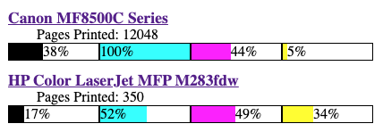

# printer_snmp
Simple python script to query basic printer data and output an HTML snippet to be included in a dashboard

In crontab, I use an entry like so:
```
0 * * * * /home/pi/Development/printer_snmp/printer_snmp > /var/www/html/printer.html
```

Which, once included in the dashboard, looks like this with no styling:


